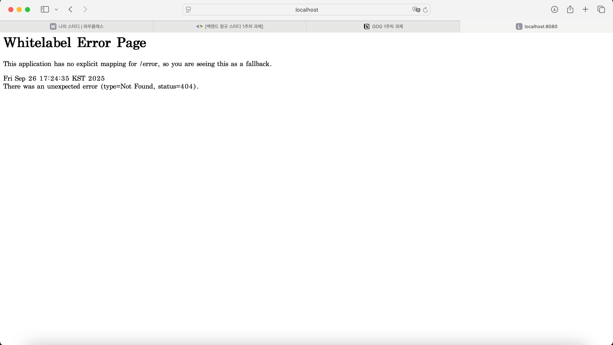
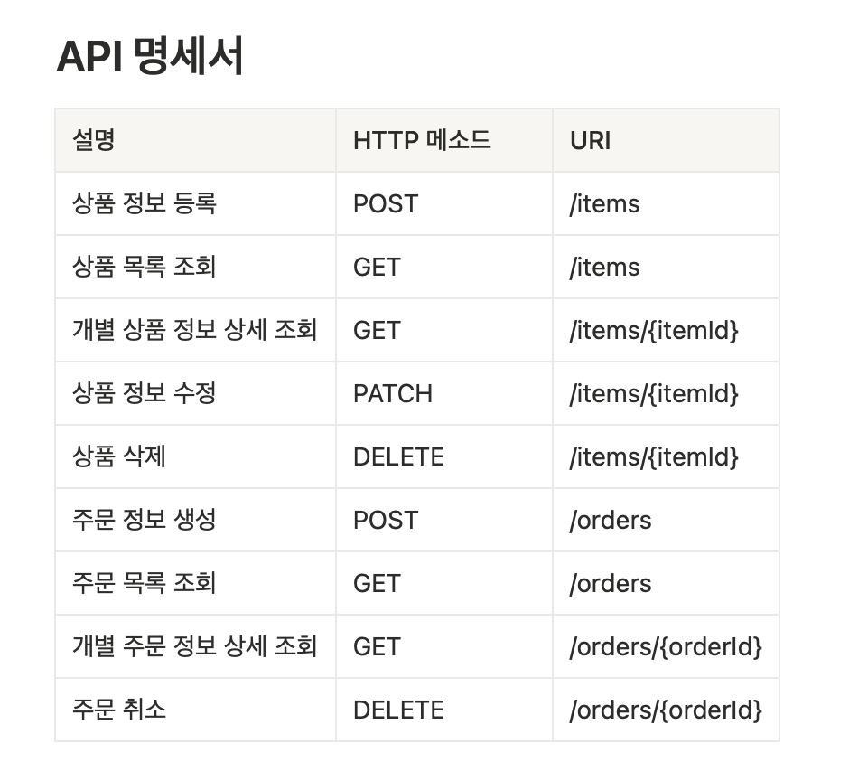

웹과 HTTP, REST API

웹이란 인터넷이라는 거대한 글로벌 네트워크 위에서 동작하는 서비스이다.
전세계 사용자들이 서로의 정보 공유를 목적으로 사용한다.

웹에서 컴퓨터들이 정보를 주고 받는 대표적인 방식은 "클라이언트 - 서버 구조" 이다.
클라이언트가 서버에게 어떤 요청을 보내면, 서버는 그 요청에 대해 응답하는 구조이다.

위에서 말한 통신 과정에서 클라이언트의 요청에는 고유한 주소가 필요하다. 웹에서 사용하는 고유한 주소 체계가 URL 이다.

URL은 리소스가 위치한 서버의 IP 주소 or 도메인을 나타내는 HOST, 서버의 특정 네트워크 포트 번호를 나타내는 PORT,
      서버 내에서 원하는 리소스의 경로를 나타내는 PATH, 서버에 추가적인 정보를 보내는 파라미터인 Query 로 구성된다.

HTTP는 클라이언트와 서버가 어떻게 통신을 주고받을지에 대해 정해놓은 일종의 규칙으로 볼 수 있다.
또, HTTP는 무상태성과 비연결성이라는 특징을 가진다.

HTTP 메소드에는 크게 5가지가 있다. [GET, POST, PUT, PATCH, DELETE]

- 프론트엔드 : 사용자와 상호작용하는 화면을 개발
- 백엔드 : 사용자의 요청을 받아서 실제 동작을 처리하고, 데이터를 저장, 관리

백엔드가 데이터를 저장, 관리하는 곳을 데이터베이스 (Database, DB) 라고 하고,
DBMS를 통해 데이터베이스를 관리, 조작한다.

API : 프로그램이 다른 프로그램의 기능을 잘 사용할 수 있도록 미리 정해놓은 규칙
REST 란 HTTP의 장점을 최대한 활용할 수 있는 아키텍처를 말하고,
이를 활용한 개념인 REST API 라는 것은 자원을 고유한 URI로 식별하고, HTTP 메소드를 정의하고, 결과를 JSON 같은 형식으로 표현하는 아키텍처 스타일을 의미한다.

