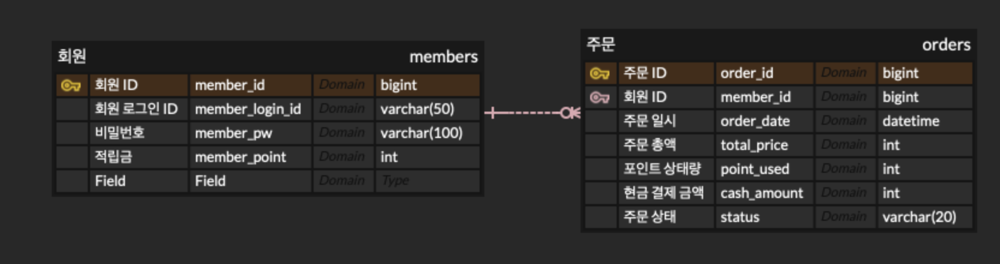
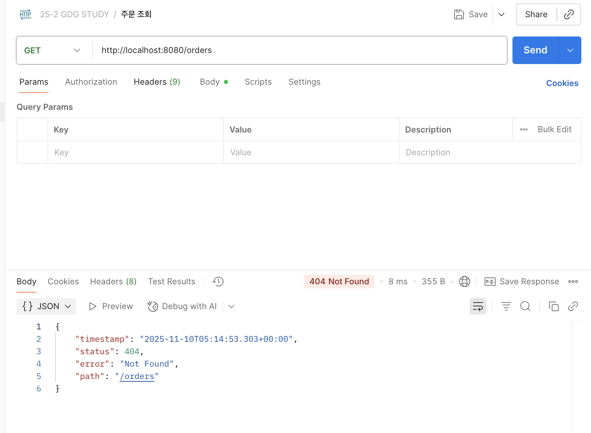
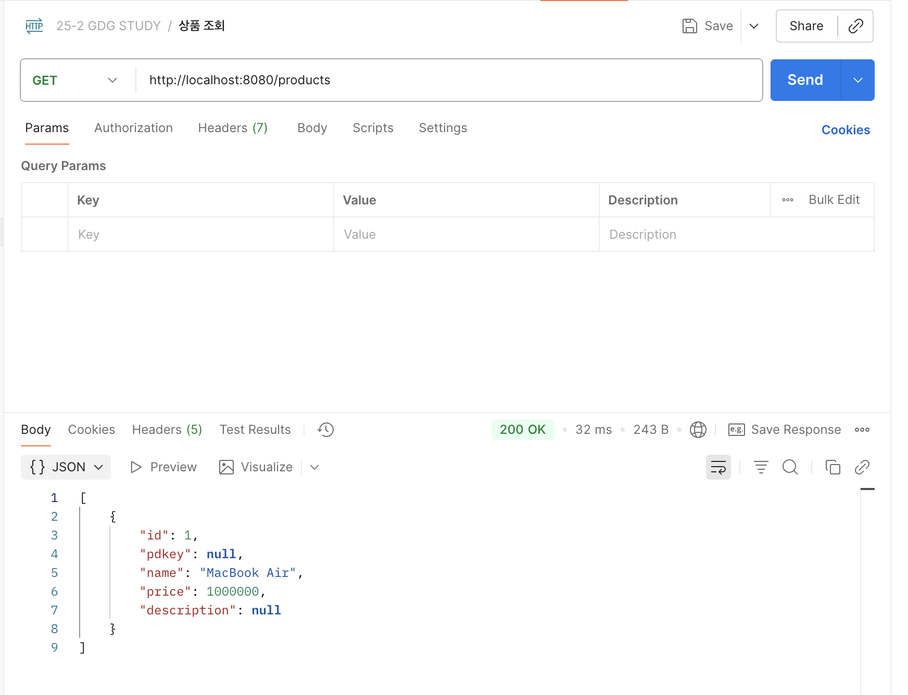

## Entity
모든 정보를 포함하고, DB 테이블과 매핑되는 핵심 객체

## ERD (Entity-Relationship Diagram)
데이터 청사진으로, Entity(개체)와 Relation(관계)를 시각적으로 표현한 그림이다.  
ERDcloud 라는 Tool을 사용해서 ERD를 그리다보면 화살표에 2가지 종류가 있다.  
식별관계와 비식별관계.  
- 식별 관계 (강한 연관 관계)  
관계 대상의 PK를 자신의 PK로도 사용
- 비식별 관계 (느슨한 연관 관계)
관계 대상의 PK를 자신의 FK로만 사용  

### 핵심 용어
1. 엔티티 : 관리해야할 데이터의 주체  
(Member, Order, Product)
2. 속성 : 각 엔티티가 가지는 구체적인 정보 (=필드, 칼럼)
3. 기본 키 : 고유하게 식별하는 데 사용되는 하나 이상의  칼럼(필드)  
(member_id, product_id, order_id)
4. 외래 키 : 다른 테이블의 PK를 참조하는 속성(컬럼)  
(ex. Order 테이블 안에서 member_id를 통해 회원에 관한 정보 열람)
5. 관계 : 개체 사이의 연관성, 업무 규칙 => 테이블 또는 외래 키로 구현  
- 다대일
- 일대다
- 일대일
- 다대다

### 실습 이미지

ERD

스프링 어플리케이션 실행 후 생성된 H2 테이블 확인

주문 도메인 API 실패 사례

상품 도메인 등록 후 조회 성공 사례