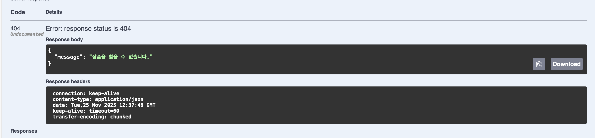

# 예외처리와 Swagger

## 유효성 검사
API 오류가 발생한 상황 -> " 500 Internal Server Error "로 통칭되었다.    

이러면 세부적으로 어떤 오류가 났는지 모르고, 서버의 오류라고만 판단할 수 밖에 없다.    

위와 같은 상황을 방지하기 위해 유효성 검사를 해야한다.

> 유효성 검사는 요청으로 들어오는 데이터가 **올바른 형식**인지 검사하는 것으로,   
Spring에서는 DTO에서 해당 유효성 검사를 진행한다.

이를 위해 먼저 다음의 의존성을 추가해줘야한다.  
'implementation 'org.springframework.boot:spring-boot-starter-validation'

이후 아래의 과정대로 진행
1. 해당 DTO에서 @NotNull, @Size, @Pattern 등의 어노테아션을 사용

2. Controller 메서드에 @Valid 추가

1번 과정을 통해서 제약 사항과 에러 메시지를 **명시** 해주고,    
2번 과정을 통해서 명시한 제약조건에 맞는지 **검사** 해주는 것이다.

## 예외 처리
> 위의 유효성 검사를 통해 500 에러 대신 클라이언트쪽 오류인 400대 에러로 변경을 해주었지만,   
구체적으로 무엇이 잘못된 건지, 무엇이 잘못 들어간건지 알 수 없다.

이를 위해 에러가 발생했을 때, 원인을 알려주는 에러 메시지를 담도록 직접 응답 객체를 생성해주었다.

### 예외 처리를 위해 필요한 요소
1. Global Exception Handler     

2. 커스텀 예외 처리

3. 에러 메시지 클래스

## API 문서 => Swagger
API 사용 설명서 (백엔드 API 명세)를 공유하는 것이다.    
프론트엔드와 소통/협업 시 API 문서를 공유해야하는데 이때 사용한다.

implementation 'org.springdoc:springdoc-openapi-starter-webmvc-ui:2.8.14'       
위의 의존성만 추가해주고 http://localhost:8080/swagger-ui/index.html# 에 들어가면 API 명세서가 만들어진 것을 확인할 수 있다!

에러 메시지 확인 (상품 도메인)
